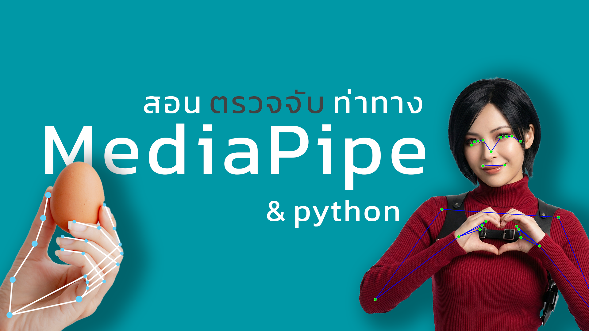
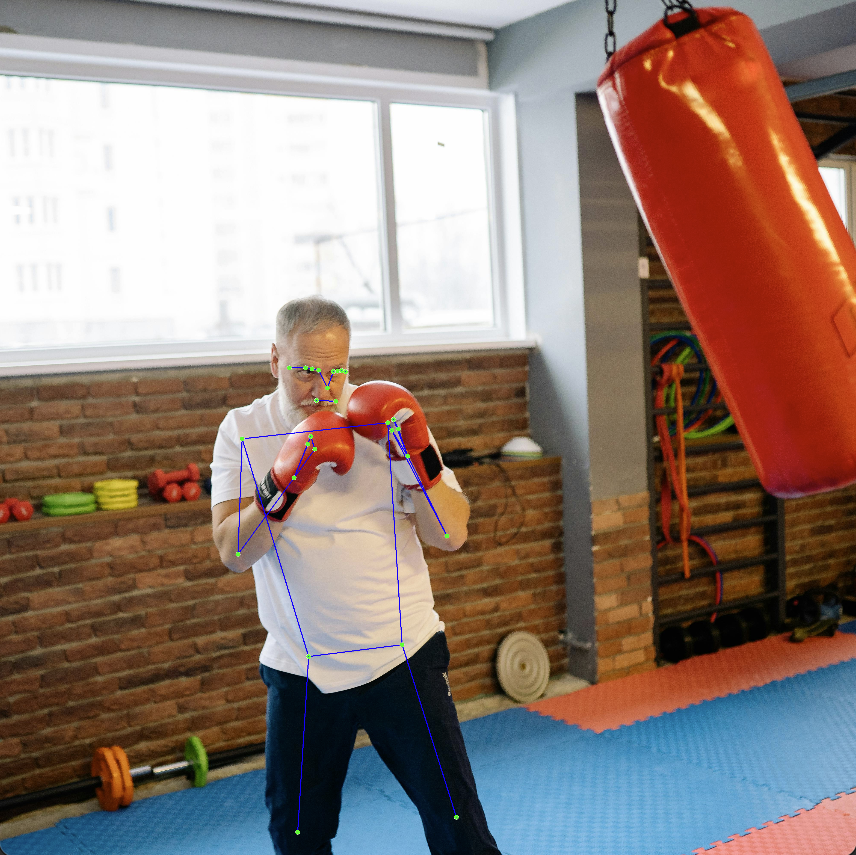
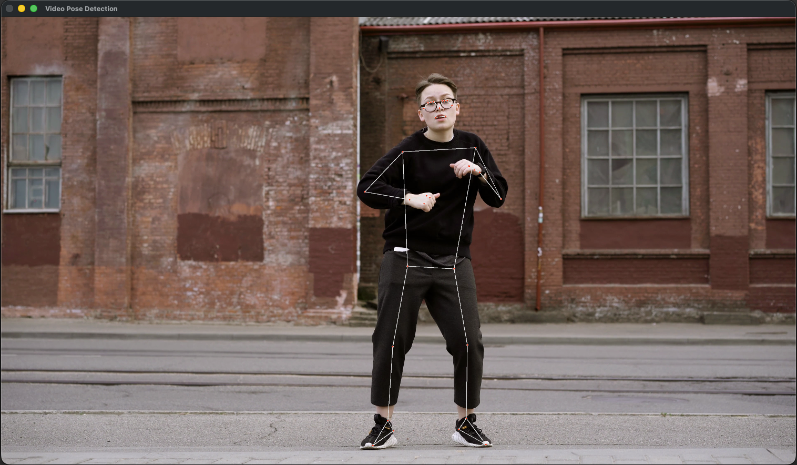
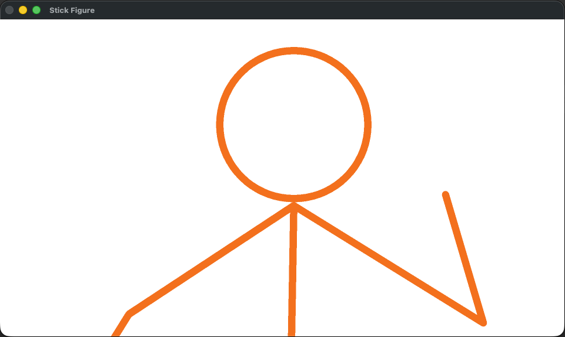
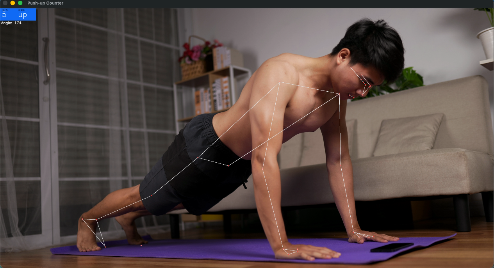

# MediaPipe Pose Estimation Example

A comprehensive tutorial project demonstrating the capabilities of MediaPipe for pose detection and estimation. This project showcases how to use MediaPipe with Python to detect human poses from images, videos, and real-time webcam feeds, with practical applications like character animation and fitness tracking.

## About This Project

This project demonstrates how modern AI and computer vision have become accessible to everyone. Using Google's MediaPipe framework, you can create sophisticated pose detection systems with just a few lines of code - no expensive motion capture equipment required!

The project includes four progressive examples:
1. **Static Image Pose Detection** - Detect poses from still images
2. **Video Pose Tracking** - Real-time pose tracking in videos
3. **Character Animation** - Create a stick figure that mimics your movements
4. **Push-up Counter** - Build a fitness tracker that counts exercises

## YouTube Tutorial

For a detailed walkthrough in Thai, check out the [video tutorial](https://youtu.be/NoWzVc71fso) on YouTube.

[](https://youtu.be/NoWzVc71fso)

## Requirements

- uv (Python package manager)
- Python 3.12
- Webcam (for real-time examples)

## Installation

1. Clone the repository:
```bash
git clone https://github.com/TitorPs360/mediapipe-pose-estimation-example.git
cd mediapipe-pose-estimation-example
```

2. Install dependencies:
```bash
uv sync
```

## Project Structure

```
mediapipe-pose-estimation-example/
├── example1.py          # Pose detection from static images
├── example2.py          # Pose tracking from video files
├── example3.py          # Real-time character animation
├── example4.py          # Push-up counter application
└── README.md
```

## Usage

### Example 1: Pose Detection from Image



Detect pose landmarks from a static image:

```bash
uv run example1.py
```

This example:
- Reads an image file
- Detects 33 body landmarks
- Visualizes the skeleton with colored lines and points
- Prints landmark coordinates (x, y, z)

### Example 2: Video Pose Tracking



Track poses in a video file:

```bash
uv run example2.py
```

This example:
- Processes video frame by frame
- Performs real-time pose tracking
- Displays skeleton overlay on the video
- Press 'q' to quit

### Example 3: Character Animation



Create a stick figure that mimics your movements:

```bash
uv run example3.py
```

This example:
- Uses your webcam for real-time input
- Draws an animated stick figure character
- The character follows your body movements
- Perfect for understanding motion capture basics

### Example 4: Push-up Counter



Build a fitness tracker that counts push-ups:

```bash
uv run example4.py
```

This example:
- Calculates elbow angles in real-time
- Detects push-up movements (up/down stages)
- Counts repetitions automatically
- Displays counter and current stage on screen

## Features

- **Real-time Performance**: Runs smoothly on regular computers and even mobile devices
- **No Special Hardware**: Works with any standard webcam
- **33 Landmarks**: Tracks face, upper body, hands, and lower body
- **3D Coordinates**: Provides x, y, and z depth information
- **Easy to Use**: Simple API with pre-trained models